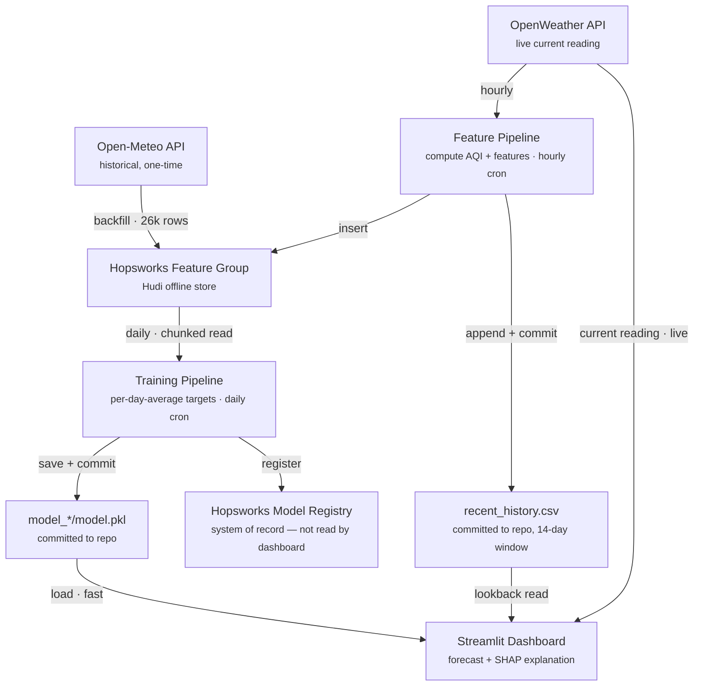
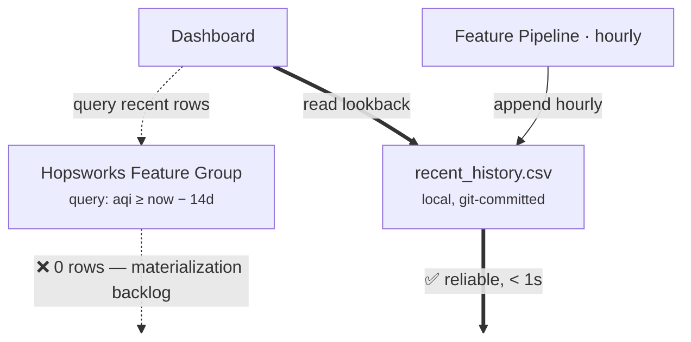

# Pearls AQI Predictor — Final Report

**10Pearls SHINE Internship — Data Sciences Track**

A serverless system forecasting Karachi's Air Quality Index one, two, and three days out — and the engineering decisions, dead ends, and one production bug that shaped it.

| | |
|---|---|
| **Location** | Karachi, Pakistan · 24.8607°N, 67.0011°E |
| **Repo** | Saadjunaid0317/aqi-predictor |
| **Live dashboard** | https://aqi-predictor-nszy3iphgpcpwzmfejrxv2.streamlit.app/ |
| **Training window** | Aug 2023 – present, 26k+ hourly rows |
| **Status** | pipeline, registry, dashboard, explainability — live |
| **Deadline** | Sept 4, 2026 |

## Contents

1. [Data & feature engineering](#01-data--feature-engineering)
2. [Automation](#02-automation)
3. [Model training & evaluation](#03-model-training--evaluation)
4. [Model registry](#04-model-registry)
5. [Live serving & the materialization bug](#05-live-serving--the-materialization-bug)
6. [Dashboard](#06-dashboard)
7. [Explainability](#07-explainability--why-this-forecast)
8. [Known limitations](#08-known-limitations)
9. [Key decisions](#09-key-decisions)
10. [What's left](#10-whats-left)

---

## Overview

Every hour, a GitHub Actions job pulls live weather and pollutant readings for Karachi from OpenWeather, computes the real US EPA Air Quality Index from the PM2.5/PM10 concentrations, and writes the result into a Hopsworks feature store. Three years of the same data was backfilled once from Open-Meteo to build a training set of roughly 26,000 hourly rows. Once a day, a second automated job retrains three independent Ridge regression models — one per forecast horizon — and registers them in Hopsworks' model registry. A Streamlit dashboard loads the latest models and shows the current reading, a 3-day forecast, and a per-prediction SHAP explanation of what's driving each number.

| Forecast horizons | Best model | Automation |
|---|---|---|
| 24h / 48h / 72h — day-average AQI, not a single point | Ridge Regression — beat RF, GB, XGBoost at every horizon | 2 cron jobs — hourly features · daily training |

---

## 01. Data & feature engineering

Two data sources feed the same feature schema. **OpenWeather** supplies the live hourly reading (temperature, humidity, wind speed, and PM2.5/PM10/CO/NO2/SO2/O3 concentrations) that the automation runs on. **Open-Meteo** supplied a one-time historical backfill covering roughly three years, used only to build a large enough training set — live automation never touches it again.

AQI itself isn't taken from either API as a pre-computed estimate. It's calculated directly from the EPA's piecewise-linear breakpoint formula applied to PM2.5 and PM10, taking whichever pollutant produces the higher sub-index as the AQI and the "dominant pollutant." Every record also carries time features (hour, day, month, day of week) and trend features: AQI 24/48/72 hours ago, the AQI's rate of change over the last 24 hours, and a rolling 24-hour mean and standard deviation.

> **Why compute AQI ourselves.** Neither API returns a directly comparable EPA AQI number, and using two different scoring conventions between the live feed and the historical backfill would have quietly poisoned the training set with an inconsistent target. Computing it once, in one function, for both paths keeps the label honest.

---

## 02. Automation

Two GitHub Actions workflows run the whole system without a server. Both commit their own output back into the repository, which turned out to matter more than it sounds — see [§05](#05-live-serving--the-materialization-bug).

*Fig. 1 — The full automated pipeline. Note that the Model Registry is a terminal node: it's the official record required by the assignment, but the dashboard loads the committed `.pkl` files directly rather than calling Hopsworks on every page load.*

**The two scheduled workflows**

| Workflow | Schedule | Runs | Commits back |
|---|---|---|---|
| Hourly Feature Pipeline | `0 * * * *` | `push_to_hopsworks.py` | `recent_history.csv` |
| Daily Model Training | `0 3 * * *` | `register_models.py` | `model_*/model.pkl`, `shap_background.csv` |

---

## 03. Model training & evaluation

The original design predicted a single AQI value at exactly 72 hours out. Following mentor and cohort discussion, the target was restructured into **three separate models**, each predicting the *average* AQI over one day's window — Day 1 (hours 1–24), Day 2 (25–48), Day 3 (49–72) — which is both closer to how AQI forecasts are conventionally reported and a simpler, more learnable target than one instantaneous far-future point. Each model is trained independently on the same feature set (a "direct" strategy), rather than feeding one model's output into the next, after a classmate found that recursive chaining compounds error badly by Day 3.

### The real evaluation bar

Ridge, Random Forest, Gradient Boosting, and XGBoost were all trained and compared. The tree-based models went **negative R²** at the 72-hour horizon — overfitting on a noisier long-range target — while Ridge stayed positive and simplest at every horizon. That pattern (Day 1 much stronger than Day 2/3, the simplest model winning) matched what nearly the whole cohort reported independently.

The mentor-confirmed registration criterion is **beating the persistence baseline** — "assume tomorrow looks like today" — not an absolute R² threshold. R² is mechanically capped low whenever the test window happens to be a calm, low-variance stretch of AQI, regardless of how good the model actually is, so persistence is the fairer bar.

**Final results — Ridge regression, chronological 80/20 split (20,937 train / 5,235 test rows)**

| Horizon | RMSE | MAE | R² | Persistence RMSE | Persistence R² | Verdict |
|---|---:|---:|---:|---:|---:|---|
| 24h | **11.49** | 8.26 | 0.569 | 16.76 | 0.083 | beats persistence ✅ |
| 48h | **14.48** | 10.78 | 0.285 | 21.44 | −0.567 | beats persistence ✅ |
| 72h | **15.02** | 11.18 | 0.176 | 23.12 | −0.952 | beats persistence ✅ |

A note on benchmarking against peers: a fellow intern on the same assignment reported a Random Forest reaching R² = 0.997 with RMSE ≈ 1.12. That combination is inconsistent with the natural noise level of a 3-day-ahead AQI forecast and reads as a strong signal of data leakage (most likely a lag feature computed too close to its own target, or a non-chronological split) rather than a genuinely better model — the same conclusion reached earlier about a different classmate's suspiciously strong SVR/CatBoost numbers. Neither was worth chasing.

---

## 04. Model registry

Each of the three trained models is registered in the Hopsworks Model Registry as `aqi_ridge_24h`, `aqi_ridge_48h`, and `aqi_ridge_72h`, tagged with its RMSE, MAE, R², and the persistence RMSE it beat, alongside an input-example schema. The daily training workflow ([§02](#02-automation)) registers a new version every run, so the registry accumulates a version history rather than overwriting in place — currently at version 2 for all three models after the first scheduled retrain.

---

## 05. Live serving & the materialization bug

This section is the one real production bug this project hit, and the fix ended up being more instructive than the model comparison.

Despite hundreds of successful hourly inserts, querying Hopsworks for anything from roughly the last one to two weeks reliably returned **zero rows** — confirmed with multiple query methods, including the same chunked-read function that works perfectly for the three-year historical set. The pipeline logs eventually surfaced the actual mechanism directly:

> **Observed in production, every hourly run:**
> `UserWarning: Materialization job is already running, aborting new execution. Please wait for the current execution to finish before triggering a new one.`

Hopsworks' Hudi-backed offline store needs a background "materialization" job to make newly inserted rows efficiently queryable. On the free tier, that job appears to be perpetually behind the hourly insert cadence — each new run tries to trigger it and is told one is already in progress. It isn't a transient blip; it's a standing backlog.

*Fig. 2 — The two paths the dashboard could take for recent AQI history. The dashed path is what the architecture nominally calls for; the solid path is what actually works, fed by the same hourly job that already computes each record before sending it to Hopsworks.*

The fix doesn't touch the required architecture: Hopsworks stays the feature store of record, every hourly run still inserts into it, and training still reads from it exclusively (older data has fully materialized by the time it's needed). The hourly script already has each record in memory the moment it computes it, so it now also appends that record to a small local CSV and commits it back to the repo — a live-serving cache that happens to live in git, purely to work around a platform-side query limitation for data younger than about two weeks.

---

## 06. Dashboard

> **A note on how this was built.** Web/frontend development is not my background — my focus for this internship is data science, not UI engineering. I used AI assistance (Claude) heavily for the Streamlit dashboard itself: the layout, CSS/styling, animations, and Plotly chart configuration. The data pipeline, feature engineering, model training/evaluation, and the SHAP explainability logic are my own work and understanding; the dashboard's visual presentation is where I leaned on AI help the most, since it falls outside my domain.

A Streamlit app shows the current reading on a color-coded EPA gauge, six live weather/pollutant stat tiles, and three forecast cards (one per horizon) with a category badge and a delta arrow against the current reading. A combined chart plots recent actual AQI against the 3-day forecast on one timeline, with a dashed line marking the transition from history to prediction. AQI severity colors are always paired with a text label and an icon — never color alone — since the standard EPA palette fails contrast and colorblind-safety checks when used as a solid fill.

*Fig. 3 — The dashboard's live view, captured during development. Models load from the committed `.pkl` files (fast, no Hopsworks round-trip); the current reading comes from OpenWeather live; the lookback history comes from `recent_history.csv`.*

---

## 07. Explainability — "why this forecast?"

Each forecast card links to a SHAP breakdown showing exactly which features pushed that day's number up or down. Because all three models are linear (Ridge), the explanation is exact rather than approximated: `shap.LinearExplainer` computes each feature's contribution as its coefficient times its deviation from a background average, so the baseline plus the sum of all contributions always equals the model's actual prediction — verified directly (base value + ΣSHAP = prediction, to six decimal places) before shipping the panel.

The background distribution is a 150-row sample spread evenly across the full ~3-year training period (not a random sample, which could over-represent any one season), refreshed automatically every time the daily training job pulls fresh data.

> **Why this, and not a bigger model.** A peer's project on the same assignment used SHAP for per-prediction explanations, which is a genuinely strong addition to a forecasting dashboard — their headline model accuracy claim wasn't credible (see [§03](#03-model-training--evaluation)), but the explainability idea was worth adopting on its own merits.

---

## 08. Known limitations

- **Cold-start lookback** — The `recent_history.csv` cache only starts accumulating from the moment it was introduced. 24-hour lookback is accurate within a day of that point; full 72-hour fidelity needs three days to build up. Until then the dashboard reports how far off its nearest available match is, rather than hiding the gap.
- **R² in calm periods** — Low R² on a low-variance test window is an artifact of that window's AQI barely moving, not evidence of a weak model — which is exactly why persistence, not an absolute R² target, is the registration bar ([§03](#03-model-training--evaluation)).
- **SHAP background is a sample** — 150 evenly-spaced rows approximate the training distribution well but aren't the full ~26,000-row set; contribution magnitudes are stable but not bit-identical to a full-background explainer.
- **Daily retraining has a 72-hour lag** — A row only becomes usable training data once its full 72-hour-ahead target window exists, so the daily job won't see genuinely new usable rows until data ages past that point — confirmed directly when the first scheduled retrain produced byte-identical models to the previous run.
- **Materialization backlog is unresolved, not fixed** — The workaround in §05 makes live serving reliable; it doesn't make Hopsworks' offline store queryable for recent data. Anything that genuinely needs a Hopsworks-side read of the last two weeks (not just the dashboard's own lookback) would still hit the same wall.

---

## 09. Key decisions

| Decision | Reasoning |
|---|---|
| Per-day-average, 3-separate-model targets | Matches mentor- and cohort-confirmed correct structure; simpler and more learnable than one instantaneous 72h point. |
| Direct strategy, not recursive chaining | A classmate found chaining compounds error and makes Day 2/3 measurably worse. |
| Stopped tuning once Ridge beat persistence everywhere | Matches the real registration criterion; protects time for the rest of the pipeline. |
| Skepticism toward suspiciously strong peer results | RMSE/R² combinations mathematically inconsistent with realistic AQI noise — a leakage signal, not a technique to copy. |
| Local `recent_history.csv` cache for live serving | Hopsworks stays the true feature store; this only works around a confirmed materialization-lag query limitation, purely for the live app. |
| SHAP via the closed-form linear explainer | Exact for a linear model, no extra retraining, and the identity base + ΣSHAP = prediction is independently checkable. |

---

## 10. What's left

Against the original brief's final-submission checklist:

- ✅ End-to-end prediction system
- ✅ Automated, scalable pipeline
- ✅ Interactive dashboard — publicly deployed at https://aqi-predictor-nszy3iphgpcpwzmfejrxv2.streamlit.app/
- ✅ This report
- ✅ Hazardous-AQI alerting (dashboard banner + automated alert log)
- ✅ Deep learning model (LSTM) evaluated alongside the statistical/ensemble models

An LSTM (24-hour input window, scaled features, small 32-unit layer to avoid overfitting the ~26k-row dataset) was added to `train_model.py`'s comparison, evaluated with the same RMSE/MAE/R² as Ridge/Random Forest/Gradient Boosting/XGBoost on the same held-out chronological test split. It won on the 24h and 72h horizons (R² 0.592 vs Ridge's 0.569, and 0.208 vs 0.176) and came close on 48h (0.280 vs Ridge's 0.285). Production still registers Ridge (`register_models.py` is unchanged) — the margins are small enough, and Ridge's simplicity/interpretability/fast retraining make it the better fit for a serverless daily-retrain setup, but the comparison satisfies the brief's "statistical to deep learning" guideline and is documented here rather than assumed.

- ✅ A full project write-up covering the API selection, data cleaning, feature engineering, every model tried and its results, the reasoning behind the final model, and every blocker hit along the way — see [`EDA_Writeup.md`](EDA_Writeup.md).

---

*Pearls AQI Predictor · 10Pearls SHINE Internship · Deadline: Sept 4, 2026*
