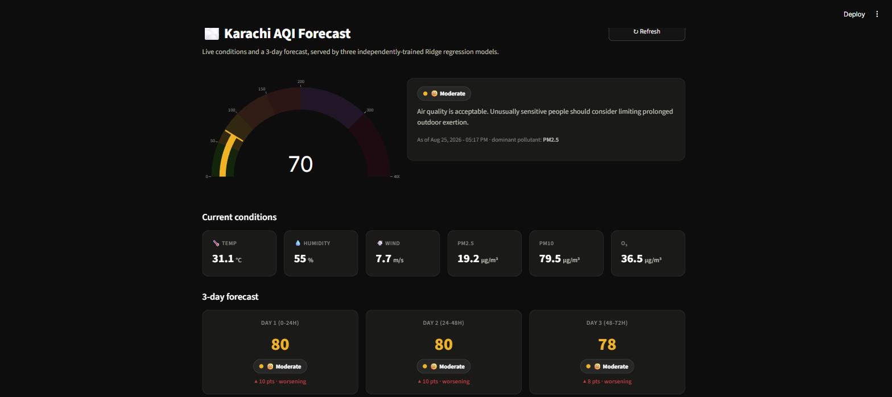

# Pearls AQI Predictor

A serverless system that forecasts Karachi's Air Quality Index 24, 48, and 72 hours ahead, with a live dashboard, automated hourly data collection, daily model retraining, and per-prediction explanations.

Built for the 10Pearls SHINE Internship, Data Sciences track. For the full write-up (architecture, model evaluation, the production bug that shaped the design, and known limitations), see [`Final_Report.md`](Final_Report.md). For the full build journey — API choices, cleaning, feature engineering, every model tried, and every blocker hit along the way — see [`EDA_Writeup.md`](EDA_Writeup.md).

**Live dashboard:** https://aqi-predictor-nszy3iphgpcpwzmfejrxv2.streamlit.app/

> Web/frontend development isn't my domain — my focus is data science, not UI engineering — so I relied heavily on AI assistance (Claude) to build the Streamlit dashboard's layout, styling, and charts. See [`Final_Report.md`](Final_Report.md#06-dashboard) for details on what's my own work versus AI-assisted.



## Features

- **Live 3-day forecast** — three independent Ridge regression models, one per horizon, each predicting the average AQI over that day
- **Real EPA AQI**, computed from PM2.5/PM10 concentrations rather than taken as a pre-scored API value
- **Hourly + daily automation** via GitHub Actions — no server to maintain
- **"Why this forecast?"** — a SHAP explanation panel showing which features are driving each prediction
- **Hazardous AQI alerts** — a dashboard banner plus an automated alert log whenever AQI crosses into Unhealthy territory or worse

## How it works

```
OpenWeather (live) ─┐                     ┌─ Hopsworks Feature Store
                     ├─▶ Feature Pipeline ─┤
Open-Meteo (backfill)┘    (hourly)         └─ recent_history.csv (repo)
                                                     │
                              Training Pipeline ◀────┘
                              (daily) → Hopsworks Model Registry
                                      → model_*/model.pkl (repo)
                                                     │
                                          Streamlit Dashboard
```

Live serving reads the current reading straight from OpenWeather and recent lookback history from `recent_history.csv` rather than querying Hopsworks directly — Hopsworks' materialization job runs behind the free tier's insert cadence, so very recent rows aren't reliably queryable. Training still reads exclusively from Hopsworks, since older data has fully materialized. Full details in [`Final_Report.md`](Final_Report.md#05-live-serving--the-materialization-bug).

## Project structure

```
app.py                     Streamlit dashboard
feature_pipeline.py        Fetches live weather/pollution data, computes AQI + features
push_to_hopsworks.py       Hourly job: inserts into Hopsworks, updates local history + alert log
backfill_pipeline.py       One-time historical backfill from Open-Meteo
prepare_training_data.py   Builds per-day-average training targets from the feature store
train_model.py             Compares Ridge / Random Forest / Gradient Boosting / XGBoost / LSTM
register_models.py         Daily job: retrains + registers models in the Hopsworks Model Registry
live_features.py           Builds the live feature row the dashboard predicts on
log_predictions.py         Hourly job: logs each run's 24h/48h/72h forecasts for later accuracy tracking

model_24h/ model_48h/ model_72h/   Trained model artifacts (also registered in Hopsworks)
recent_history.csv         Rolling 14-day local cache, updated hourly
alerts_log.csv             Log of hazardous AQI readings (created once one occurs)
predictions_log.csv        Log of past forecasts, matched against actuals for the dashboard's accuracy chart
shap_background.csv        Background sample for the SHAP explainer, refreshed daily

.github/workflows/         The two scheduled GitHub Actions jobs
.streamlit/config.toml     Dashboard theme
Final_Report.md            Full internship report
```

## Getting started

**1. Clone and install dependencies**

```bash
git clone https://github.com/Saadjunaid0317/aqi-predictor.git
cd aqi-predictor
pip install -r requirements.txt
```

To also run `train_model.py`'s model comparison (it includes an LSTM candidate), install `requirements-dev.txt` too — TensorFlow is kept out of the base `requirements.txt` so the dashboard and automation workflows don't carry that weight:

```bash
pip install -r requirements-dev.txt
```

**2. Set up API keys**

Create a `.env` file in the project root:

```
OPENWEATHER_API_KEY=your_key_here
HOPSWORKS_API_KEY=your_key_here
```

**3. Run the dashboard**

```bash
streamlit run app.py
```

## Automation

| Workflow | Schedule | What it does |
|---|---|---|
| Hourly Feature Pipeline | every hour | Fetches live data, pushes to Hopsworks, updates `recent_history.csv` and `alerts_log.csv` |
| Daily Model Training | 03:00 UTC | Retrains all three models, registers new versions in Hopsworks, updates the committed `.pkl` files and `shap_background.csv` |

Both are defined in `.github/workflows/` and require `OPENWEATHER_API_KEY` and `HOPSWORKS_API_KEY` as repository secrets.

## License

MIT — see [LICENSE](LICENSE).
